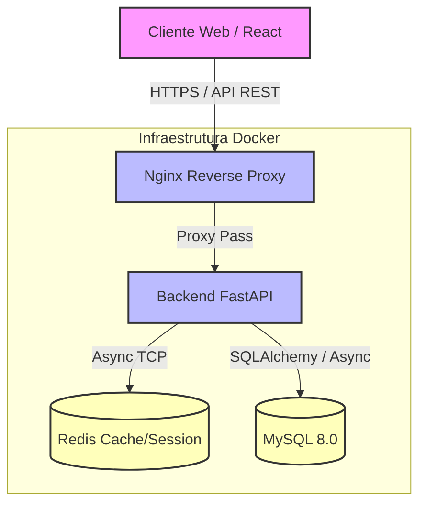

# Arquitetura do Sistema

Este documento descreve a arquitetura de software e infraestrutura do SST Manager.

> [!TIP]
> A arquitetura prioriza separação de responsabilidades, facilitando a manutenção e a futura divisão em microsserviços, caso necessário.

## Diagrama de Arquitetura



## Explicação das Camadas (Backend)

O backend em FastAPI segue uma arquitetura em camadas para organizar o código:

1. **Routers (`routers/`)**: Recebem as requisições HTTP, validam os dados de entrada usando schemas Pydantic e retornam as respostas. Não devem conter regras de negócio complexas.
2. **Dependencies (`dependencies/`)**: Injeção de dependências do FastAPI (ex: extração e validação do JWT, recuperação da sessão do banco de dados, identificação do `tenant_id`).
3. **Schemas (`schemas/`)**: Modelos Pydantic responsáveis pela serialização e desserialização de dados (DTOs - Data Transfer Objects).
4. **Models (`models/`)**: Modelos do SQLAlchemy que mapeiam exatamente as tabelas do banco de dados relacional.
5. **CRUD / Services (`crud/` ou `services/`)**: Centralizam as operações de banco de dados e regras de negócio. Atualmente padronizado no formato de repositórios/crud.

## Padrões de Projeto

- **Padrão Repository/CRUD**: A interação direta com os modelos do ORM é abstraída nos arquivos de CRUD, permitindo que a rota apenas chame funções como `get_funcionario(db, id)`. (Futura transição para camada de Serviço robusta planejada).
- **Injeção de Dependências**: Utilizada largamente graças ao FastAPI (`Depends()`), especialmente para gerenciar sessões do DB e contextos de usuário autenticado.
- **Isolamento Multi-tenant via Injeção**: O isolamento de dados é alcançado garantindo que toda query obrigatoriamente receba o `tenant_id` fornecido pela dependência `get_current_tenant`.

## Estrutura de Diretórios (Backend)

```text
backend/
├── app/
│   ├── core/           # Configurações gerais, segurança (JWT, hash), variáveis de ambiente
│   ├── db/             # Conexão com banco, engine SQLAlchemy, sessões
│   ├── models/         # Entidades do SQLAlchemy
│   ├── schemas/        # Modelos Pydantic para validação
│   ├── crud/           # Lógica de acesso a dados
│   ├── routers/        # Definição de endpoints API
│   ├── api.py          # Agregador de routers
│   └── main.py         # Ponto de entrada da aplicação FastAPI
├── tests/              # Testes automatizados
├── alembic/            # Migrações do banco de dados
├── requirements.txt    # Dependências do Python
└── Dockerfile          # Definição do container backend
```

## Como o Multi-tenancy Funciona

A aplicação utiliza o modelo de **Banco de Dados Compartilhado com Esquema Compartilhado (Shared Database, Shared Schema)**.

> [!WARNING]
> Nunca faça uma query sem incluir o filtro do `tenant_id`.

- Cada tabela principal possui uma coluna `tenant_id` que é chave estrangeira para a tabela `tenants`.
- Quando um usuário se autentica, seu token JWT contém o `tenant_id` ao qual ele pertence.
- A dependência de segurança extrai esse `tenant_id` e o injeta na rota.
- O CRUD adiciona `.filter(Model.tenant_id == current_tenant_id)` a todas as operações de banco.

## Como a Autenticação Funciona

O fluxo utiliza JWT (JSON Web Tokens) sem estado no servidor:

1. O cliente envia email e senha.
2. A rota `/auth/login` valida o hash via bcrypt.
3. Se válido, gera um Access Token (curta duração) e um Refresh Token (longa duração).
4. O cliente armazena esses tokens de forma segura e os envia no cabeçalho `Authorization: Bearer <token>`.
5. O backend decodifica o token para identificar o usuário, seu cargo (role) e seu tenant, permitindo a execução de regras RBAC.
