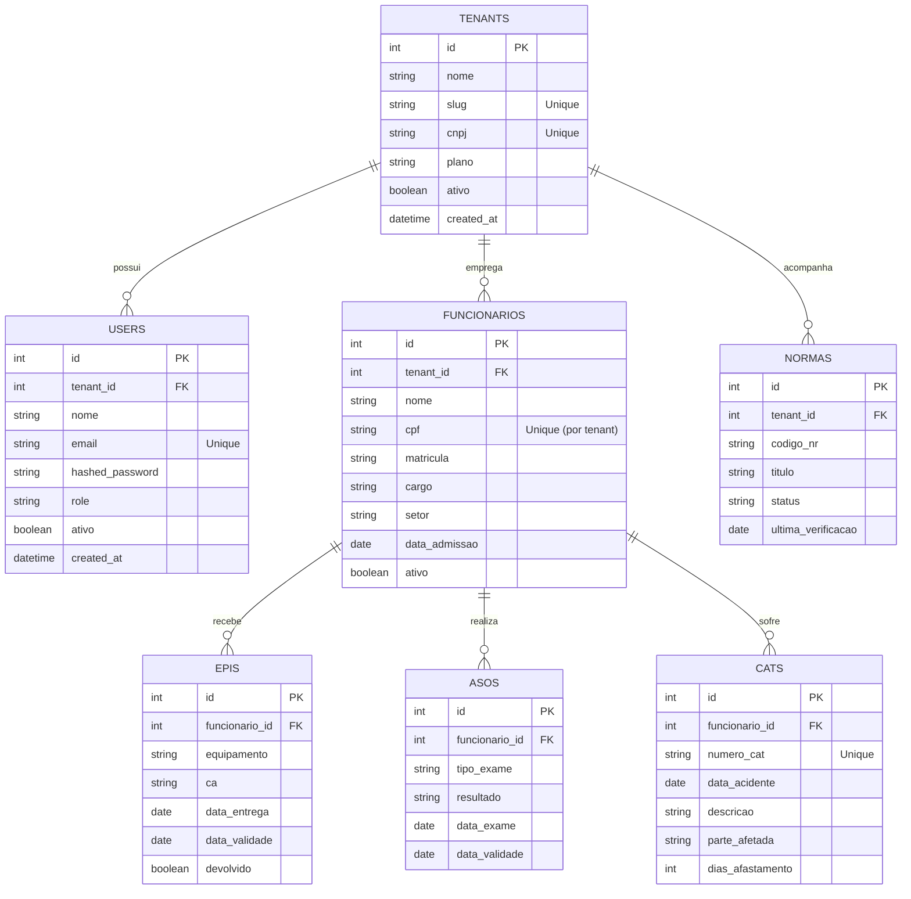

# Banco de Dados

Este documento descreve a estrutura do banco de dados MySQL e a estratégia de armazenamento do SST Manager.

> [!TIP]
> Utilizamos SQLAlchemy ORM assíncrono para interagir com o banco de dados.

## Diagrama Entidade-Relacionamento (ERD)

## Descrição das Tabelas Base

### Tabela `tenants`
Identifica as empresas ou clínicas que contratam o SaaS.
- **id**: Primary Key.
- **nome**: Nome da empresa.
- **cnpj**: CNPJ (Unique Index).
- **slug**: URL amigável para acessos customizados (Unique).

### Tabela `users`
Usuários do sistema (pessoas que fazem login).
- **tenant_id**: Vincula o usuário ao tenant.
- **email**: Usado para login (Unique Index).
- **role**: Controle de acesso RBAC (`admin`, `gestor`, `tecnico`, `visualizador`).

## Isolamento Multi-tenant e Estratégia de Índices

> [!CAUTION]
> Para garantir performance em um banco compartilhado, os índices devem ser criados compostos com o `tenant_id`.

**Índices recomendados:**
- `idx_funcionarios_tenant` (tenant_id)
- `idx_usuarios_tenant_email` (tenant_id, email)
- Constrições de unicidade (Unique Constraints) devem incluir o tenant: ex. CPF do funcionário só precisa ser único dentro de um mesmo tenant.

## Migrações (Alembic)

O esquema do banco é versionado usando **Alembic**.
Nunca altere tabelas manualmente no banco de dados; crie sempre um script de migração usando `alembic revision --autogenerate -m "descricao"`.
