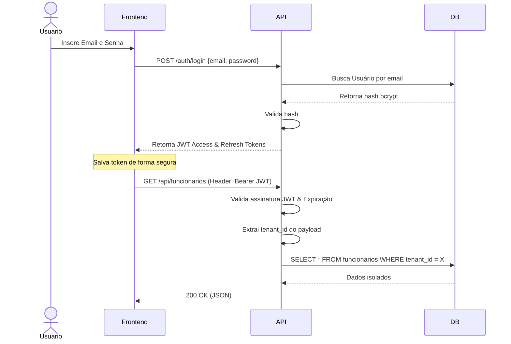

# Segurança e Controle de Acesso

A segurança é tratada com extrema seriedade no SST Manager, abrangendo desde autenticação até proteção contra ataques comuns de web.

## Fluxo de Autenticação JWT



## Estrutura do Token JWT

O payload do JSON Web Token (JWT) contém claims não sensíveis:
```json
{
  "sub": "1",             // ID do usuário
  "tenant_id": "42",      // ID do tenant para isolamento
  "role": "admin",        // Para autorização RBAC
  "exp": 1699999999       // Expiração
}
```

> [!WARNING]
> Senhas e dados sensíveis **nunca** são inseridos no payload do token. O segredo usado para assinar o token (`SECRET_KEY`) deve ser uma variável de ambiente forte e nunca "hardcoded".

## Hashing de Senhas

Utilizamos a biblioteca `passlib` configurada para **bcrypt**. Senhas em texto claro jamais tocam no banco de dados.

## Controle de Acesso Baseado em Cargos (RBAC)

A aplicação suporta 4 perfis de usuário definindo ações autorizadas:

| Role (Cargo) | Leitura Global | Escrita/CRUD (Módulos) | Gestão de Usuários e Config. |
|--------------|----------------|------------------------|------------------------------|
| **admin**    | Sim            | Sim                    | Sim (Criar usuários, etc)    |
| **gestor**   | Sim            | Sim                    | Não                          |
| **tecnico**  | Sim            | Sim                    | Não                          |
| **visualizador**| Sim         | Não (Somente leitura)  | Não                          |

A autorização é aplicada nas rotas usando `Depends` do FastAPI validando o `role` contido no JWT.

## Práticas e Proteções Implementadas

1. **Security Headers**: Uso de middlewares (como o do framework ou Nginx) para adicionar headers (HSTS, X-Content-Type-Options, X-Frame-Options).
2. **CORS (Cross-Origin Resource Sharing)**: Configurado estritamente para os domínios frontend aprovados via variáveis de ambiente.
3. **Rate Limiting**: Planejado para evitar força bruta nos endpoints de `/auth`.
4. **Sem segredos no código**: O repositório git ignora arquivos `.env`.
